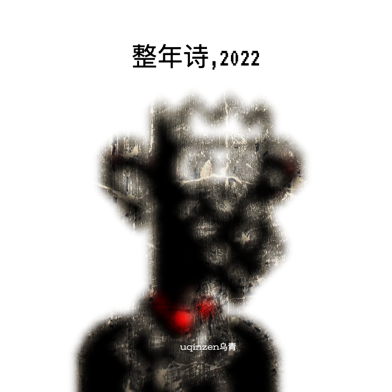

 

整年诗ZEN1ANS,2022
By uqinzen乌青

## 2022诗

诗
我理解到它超出我的理解
包含
1/它超出我理解
2/我理解1
3/虽然我理解1，但它超出我的理解
所以我不可能知道什么是诗
4/这就是2022诗

## 报死机

今天我想写一个小说
叫[报死机]
说的是李滑铁在一个二手市集上
无意中看到一个叫报死机的东西
像个小U盘
但光溜溜的没有任何按键
也没有任何显示信息
卖家搞得有点神秘
说这东西来历不明
每天它会说一句话：
你特么肯定会死的
就这么一句话
每天只说一遍
但具体时间并不固定
似乎是随机的
但反正一天中总会
突然来这么一句：
你特么肯定会死的
\ \ 
这显然是一句废话
也可以说是一句诅咒
但李滑铁觉得好玩
一问价：444块
他买下了
这已经是三年前的事了
当时他跟朋友们说
朋友们也都觉得有意思
但谁也没有听到过报死机说话
因为它报死的时间不确定
除非运气特别好
或者跟着李滑铁一整天
否则听到的概率是1/86400
有人觉得李滑铁是在开玩笑
只有李滑铁自己知道
这是什么感觉
他说刚开始他经常被那突如其来的声音给吓一跳
由于没有开关他一度想把它扔掉
又觉得四百多块钱可惜
就塞到了装棉服的箱子里
箱子在储藏间
差点就忘了
但是有一天又莫名其妙的想起来了
又把它找了出来
后来渐渐就喜欢上了这个
报死机
喜欢听它的每日报死
甚至离不开了
每天必须听了才能安心
很多时候它是半夜报死
李滑铁也只能等着它
等到它说了那句：
你特么肯定会死的
之后才能安心入睡
\ \ 
有一天
李滑铁等了个通宵
报死机没有报死
这可把李滑铁急坏了
我干，报死机不会死机了吧
又过了两天
报死机都没有任何动静
确实是坏了
可能是没电了？
可是这玩意根本不知道怎么换电池啊
也不知道上哪儿修
这几天没有报死机的报死
李滑铁完全没睡觉
特别难受
简直想死
他拿着报死机去找了一些修钟表的
修电脑的修电器的
都说没见过这种东西不会修
\ \ 
你特么肯定会死的
李滑铁脑海中回荡着报死机的声音
缓缓的他感到这一刻来了
自己终于要死了

## 这不是一首诗

任何一首诗
都可以是
一首诗
除了
这首

## 诗的孩子

当我写诗的时候
我意识到另一些人
也在写诗
皆以为各写各的
然而东兔西乌
在诗的眼中
我们都是
诗的孩子

## 像尘埃般

对与错
像尘埃般存在
好与坏
像尘埃般存在
你和我
像尘埃般存在
或不存在

## 爱死神

我16岁那年
爱上了死神
她说她会冷酷无情的
带走所有不想死的人
温柔的慰藉
每个想死的人

## 第二天

第二天
异常安静
异常疲惫
心中一片凉意
It's over
都结束了，他想
然后他看见角落
还有一片碎玻璃
走过去
捡起来
丢进垃圾桶
继续坐在沙发上
直到天色渐渐暗下来

## 两个自杀的人

在天台
一个自杀的人
遇到另一个自杀的人
两个自杀的人
一个哭
一个笑
笑的对哭的说
第一次吧？

## 写清楚

如何把一首诗
写清楚
我想只能多写
一遍一遍的写
越写越少
写到一个字：
诗

## 想要什么就写出来

在一首诗里
诗人想要什么就写什么
比如我想要一座山
就写：
一座山
想要很多金子
就写：很多金子
现在
山有了
金子也有了
这很容易
难的是
诗从哪里来

## 良心诗

常常想
良心这东西
到底有没有
今日写下这首
良心诗
就是为了证明
良心是有的
世上既有良心诗
必先有良心

## 向日葵种子

视频中
一个乌克兰女人走到街上
质问一个荷枪实弹的俄罗斯士兵
你是谁？你特么在这里干什么？
士兵让她走开，并警告她
不要让事态恶化
还怎么恶化？她说
如果你们已经占领了这里
然后她递给士兵一把种子
她说，给你们这些向日葵种子
放在口袋里
这样如果你们倒下
尸体上就会长出向日葵

## 铁链诗

一条铁链⛓️
一个女人
多少条铁链⛓️
多少个女人
铁链锈了
人疯了
人死了
铁链依旧牢固耐用
等待着下一个

## 铁链诗//贰

看得见的铁链
套在她的脖子上
看不见的铁链
套在我们的脖子上
看得见和看不见的铁链
让我们无法解开对方的铁链

## 铁链诗//叁

这条铁链很长
很长很长非常长
我们只看见这一头
套着一个女人
谁知道
那一头
套着什么

## 战伤

战场上
一个士兵问我
你为何如此忧伤
我看见了很多人
什么人
死人
在哪儿
到处都是
胡说八道——为什么我没有看见
有的死人会说话
说什么
说他什么也没看见

## 隔离

在这栋楼
的后面
是一栋烂尾楼
一栋30多层的烂尾楼
那是我唯一
想去的地方

## 成都之春2022

盖着冬天的被子
半夜热醒
把腿脚伸出去
又有点冷
下午去星巴克
里面空调开得太冷
外面又太热
反复进进出出
远方的俄乌战争
看得我眼睛痛

## 写作让我睡个好觉

任何问题都可以通过写作解决
写作让我睡个好觉
在梦里写作
或醒来再写

## 一颗开口的糖炒板栗

有人把它剥开
把里面的板栗仁吃了
另一个人在半夜想起它
不是作为一种食物
仅仅作为一颗开口的糖炒板栗
在有人吃掉它之前

## 灾难敏感者

远方一场灾难
132人从天坠落
灾难敏感者
浑身无力

## 跳楼视频

今年看到的跳楼视频
比我过去四十多年看过的
加起来还要多
各种高度
各种角度
窗户和阳台
没有犹豫
没有救援
只有旁人的惊叫和叹息
摔成鼻涕状的尸体
被熟练地塞进黑色塑料袋
送去烧成灰
送去做化肥

## 19点

19点
看起来
离死亡很近
在此之前
在此之后
不敢去想

## 女主能幸福多久

电影的结尾
女主在海边开了家小店
过上了幸福的生活
可惜幸福没有长久
续集上映
一开场她就死了
我在想
如果不拍续集
或者再多等几年上映
那女主是不是可以多幸福几年

## 梦的终点

一次梦到终点
还不确定
好多次
不同的梦
梦到梦的终点
再也梦不过去
说明那里
确实是梦的终点
在梦的终点
我的梦等着你的梦

## 半夜的哭泣声

半夜的哭泣声
不知从何处传来
好似女人的
又好像孩子的
或许是我自己的

## 找生产日期

有一种游戏叫
找生产日期
有些东西的生产日期
非常难找
它很醒目的告诉你
保质期多长时间
然后让你自己找
生产日期
可是有些包装的生产日期
真是太难找了
这就像一种游戏
很多人放弃了
但我一定要找到它

## 命运2022

一个游走的算命先生
走过去
遇见另一个游走的算命先生
走过来
两人插肩而过

## 无望湖

无望湖是乌青
写于2022年4月
上海封城之际
的一首诗
全诗没有写到湖
令人感到无望

## 404之声

喂，你听到了吗
我的朋友
你听到四月之声了吗
没听到吗
你说什么
我听不到
喂
我说的是四月…
对
你听到了吗
我能听到
对对对
我也听到了

## 牛吃草的声音

放牛的孩子
对我说
他喜欢听
牛吃草的声音
问我要不要一起听
好啊，于是我们坐在草地上
一起听
牛吃草的声音
听了一整天
现在还想听

## 瘸子走向水果摊

他一瘸一拐地
走向水果摊
在摊前看了一会儿
又一瘸一拐地
走了

## guozi

一个果子
从树上摘下来
漂洋过海送到了遥远的
某个人的手里
他拿起这个果子
削掉果皮
递给了另一个人
那个人站在阳台
看向远方
果皮被丢在垃圾桶
表面沾有微量泥土
来自外太空

## 会走的垃圾袋

有一天我的垃圾袋
自己会走了
它装满垃圾
自己就跑去了垃圾场
我跟在后面
追着它
像一个被垃圾袋遗弃的垃圾

## 问题2022

每天出现问题
然后解决问题
大部分能解决
有的无法解决
就算了
相当于解决了
还有的问题
你不知道
是解决了
还是
没解决

## 端午2022

上哪端呢
到了中午
闷热有霾
她心情不好

## 我的老

当我躺下来
感受我的老
一首诗闪现
无法写出来

## 情绪云

外卖小哥 飞驰在路上
下一秒 横尸街头
救护车迟迟不来
他的灵魂等不及了
飞驰而去
给自己送一份死讯
我呢，不知道在等什么

## 活的

他们迫不及待把老人
装进黄色的裹尸袋
殡仪馆来装车
工作人员拉开拉链
叫道：活的
然后呢
然后他们把拉链
又拉上了

## 三个城管走进一家饭馆

我看见三个城管走在路上
走得悠哉悠哉
像三个骄傲的将军
趾高气昂大腹便便
路两旁的小摊贩纷纷躲闪
其中一个时不时冲摊贩喊两句
哎，注意点儿...
我跟在他们后面
走了一截，他们站住
互相嘀咕了几句
又继续往前走
走到路尽头的一家中型饭馆
他们一拐走向饭馆大门
饭馆门口路边摆了不少桌子
吃饭的人和服务员似乎都有所警惕
他们瞥了瞥，径直走进饭馆
几个服务员瞬间停住了手中的活
老板也显得有点不知所措
三个城管找了张桌坐下
拿起桌子上的菜单
我不知道后续怎么样
三个城管走进一家饭馆
也许只是来吃饭
毕竟城管也是要吃饭的

## 坏人一定会被打死吗

我看不会
坏人会死几个
好人也会死掉几个
最后
他们将共存
在这部电影里

## 男幽女默

很显然他的幽默
已经幽不动她的默
不知是太难过
还是太冷漠
总之最后是男幽女默

## 一种爱

有一种爱
我说不清
它很重要
但我写出来
却不重要了

## 好人与坏人

好人多的时候
坏人很爽
但你知道吗
当坏人越来越多的时候
做好人其实很也挺爽的

## 雨开始下

雨开始下
我无法做出下一步判断
越下越大雨
还是很快会停
或者就这么一直下着
不大不小
街上的行人有的
开始奔跑起来
我不知道
奔跑和雨
是什么关系
也不知道
在雨中奔跑
和在雨中漫步
谁显得更傻

## 一只鹰

关于鹰
在夏天
一杯咖啡
想起鹰
又忘掉鹰

## 另一只鹰

一只鹰
他说
并没有人听见
听见也不明白什么意思
连他自己也不知道
一只鹰
意味着什么
其实他没有真的说
只是在心里说了一句
随后
他去了阳台
抬头看向天空

## 都要花时间

洗碗需要花时间
叠衣服也要花时间
我在洗碗
你在叠衣服

## 光天化日

没有人
没有事
只有光天
与化日

## 马儿的告别

再见，马儿
你跑得真快啊
刚说完再见
就已经远去
远到不能
说第二次再见

## 洗碗艺术家

这个世界上没有人喜欢洗碗
除了洗碗艺术家
洗碗艺术家
不是因为他洗碗洗得好
而是因为他
发自内心的
真的
喜欢洗碗

## 洗碗往事

不是关于洗碗的往事
而是洗碗时想起的往事
洗碗往事足以写个长篇
追忆似洗碗水年华

## 祝福

我希望你幸福
但我也知道
我不可能让你幸福
谁也不可能想让谁幸福就幸福是吧
连上帝也做不到
所以这只是一句祝福的话
我甚至都没有说出来
只是在心里想了想

## 空白

是不是世上的每一个湖
都有人淹死
如果哪个湖没有
它一定很美
我想去
填补
那个空白

## oldyoutiao

老油条
old youtiao
当一根油条老了
说实话我根本就分不出年轻的油条和老油条
买油条的时候
老板也没有告诉我
这根油条是年轻的
还是老的
但是卖油条的老板已经老了

## 一只袜子

一只袜子
在天上
另一只在哪
不知道
这只袜子只能一直待在天上

## 一起吃西瓜

一起吃西瓜
个个吃撑了
想起从前
也是这样

## 一个中国诗人去做核酸

一个中国诗人
去做核酸
所有的中国诗人
都要做核酸
他们张大嘴巴
连一声
“啊——”
都发不出来

## 习以为常

想起一个成语：
习以为常
当下
有种怪怪的感觉
习
以
为
常
如果你也觉得怪怪的
说明你还不够习以为常

## 小镇往事

嘿～～
你知道那个卖豆花的女人吗
那个卖豆花的女人
她就住在东大街的某个巷子
嘿～～
你知道那个卖肚脐饼的男人吗
那个卖肚脐饼的男人
他就住在南大街的某个巷子
嘿～～
你知道那个卖生煎的女人吗
那个卖生煎的女人
她就住在西大街的某个巷子
嘿～～
你知道那个卖糕头的男人吗
那个卖糕头的男人
他就住在北大街的某个巷子

## 杀鱼记

西元2022年10月19日
此生第一次杀鱼
误买了两条活鱼
犹豫片刻
提刀杀之
杀鱼的人许许多多
可有几人
记下
第一次杀鱼的
日子

## 早睡早起

夜深了
有的朋友已经睡了
有的朋友还没睡
我要去睡了
对于已经睡着的朋友
我还醒着
对于还没睡的朋友
我已经睡了

## 不要要

不要
要
不要
要
不要
要
注意
是
不要
要
而不是
要不要

## 阳光带来的幸福

太阳照到墙角的时候
一群孩子站在墙角
晒太阳
阳光带来的幸福
持续了三十年
或三十亿年

## 怀揣白纸

从今天开始
我每次出门
都会带上一张白纸
即便我没有勇气
在人群中举起白纸
但我自己知道
我的怀里也有
一张白纸
它会找到
另一张白纸

## 风吹风

我的吹风机
放在阳台上
被风吹走了
它在天上吹风

## 地震与核酸

地震啦！
大喇叭喊道：
地震啦！地震啦！
大家快下来做核酸！
快下来做核酸！

## X是个SB

X有很多解释
SB也有很多解释
但是没必要解释
X就是一个大SB

## 没写

像一个杀手
去杀人
到了眼前
却没杀
一个诗人
写诗
也时常如此

## 养锅

当我很认真的说
我在养锅
别人就笑
养锅有什么好笑的
你们不做饭吗

## 此处蚊子很多

我坐在这里写诗
\
就被咬了几个包
\
具体几个包
跟这首诗
应该没什么关系
\
大约7个
\
这是你在此诗
读到的数量
它和事实
没什么关系

## 理解2

人和人
如何理解
正常人无法理解疯子
可疯子就是正常人变的
就在一瞬间
就再也无法理解自己了

## 雨天回到住处的感觉

仿佛核爆炸之后
回到家
坐下来
煮杯咖啡
等待人类毁灭

## 欲火焚身

一个男人说
我欲火焚身
一个女人说
我欲火焚身
然后又一个男人说
我欲火焚身
另一个女人说
我欲火焚身
第五小节
男人和女人
同时说
我欲火焚身
但他们的声音
似乎相距遥远

## 小事+大事

a
我喝了一杯咖啡
吃了一块巧克力
然后去洗杯子
然后接了一杯水
然后回到座位
取出一片泡腾片
放进杯子里
水立刻泡腾起来
b
导弹落在了公园里
一个正在跑步的人
被冲击波掩盖
c
我并没有什么好心情
但我吃了很多
饼干
d
正在开会的人
面沉如泥
再大的权力
只是人类的权力
历史
就像贝尔不等式
不成立
e
感受身体
感受死亡
感受时间
349天后
记得claim

## 桥上的人

桥上的人
已经不在桥上
但是桥上的人啊
在我的脑海中
他一直站在桥上
只有他一个人
是桥上的人

## 低电量🪫

还剩20%的时候
它弹出一个提升
我的反应
不是去充电
而是
赶紧打开uqn
写一首诗

## 1101

梦见去一家咖啡馆
坐下来
发现旁边的椅子背
搭着一件衬衫
感觉是我的
随后意识到
这是去年我落在这的
已经过去一年了
落满灰尘
我决定拿回家好好洗洗
后来我醒来
发现自己忘了拿
于是我回到梦里
去拿
但衬衫已经不在了

- - - -
整年诗ZEN1ANS,2022
By uqinzen乌青
Wuqing.org